# Profiling in Java with JProfiler

## Why and when?

- Something is slow
- Something uses too much memory
- Need to optimize

## Java optimizations

Optimizations you get for free!

### Compilation time optimization

[CompilerOptimizationWithFinalExample.java](../src/main/java/presentation/optimization/CompilerOptimizationWithFinalExample.java)

```java
public class CompilerOptimizationWithFinalExample {
  private static final boolean IS_PRINTING = false;

  public static void main(String[] args) {
    for (int i = 0; i < 100_000_000; i++) {
      if (IS_PRINTING) {
        System.out.println("i = " + i);
      }
    }
  }
}
```

After compile:

```java
public class CompilerOptimizationWithFinalExample {
  private static final boolean IS_PRINTING = false;

  public CompilerOptimizationWithFinalExample() {
  }

  public static void main(String[] args) {
    for(int i = 0; i < 100000000; ++i) {
    }
  }
}
```

[CompilerOptimizationWithoutFinalExample.java](../src/main/java/presentation/optimization/CompilerOptimizationWithoutFinalExample.java)

```java
public class CompilerOptimizationWithoutFinalExample {
  private static boolean IS_PRINTING = false;

  public static void main(String[] args) {
    for (int i = 0; i < 100_000_000; i++) {
      if (IS_PRINTING) {
        System.out.println("i = " + i);
      }
    }
  }
}

```

After compile:

```java
public class CompilerOptimizationWithoutFinalExample {
  private static boolean IS_PRINTING = false;

  public CompilerOptimizationWithoutFinalExample() {
  }

  public static void main(String[] args) {
    for(int i = 0; i < 100000000; ++i) {
      if (IS_PRINTING) {
        System.out.println("i = " + i);
      }
    }
  }
}
```

[LiteralConstantExample.java](../src/main/java/presentation/optimization/LiteralConstantExample.java)

```java
public class LiteralConstantExample {
  public static void main(String[] args) {
    int age = 3 * 7 + 1;

    final String firstName = "Jon";
    final String lastName = "Snow";
    String fullName = firstName + " " + lastName;

    String firstName2 = "Daenerys";
    String lastName2 = "Targaryen";
    String fullName2 = firstName2 + " " + lastName2;

    System.out.println(fullName + " is " + age + " years old");
    System.out.println(fullName2 + " is also " + age + " years old");
  }
}
```

After compile:

```java
public class LiteralConstantExample {
  public LiteralConstantExample() {
  }

  public static void main(String[] args) {
    int age = 22;
    
    String firstName = "Jon";
    String lastName = "Snow";
    String fullName = "Jon Snow";
    
    String firstName2 = "Daenerys";
    String lastName2 = "Targaryen";
    String fullName2 = firstName2 + " " + lastName2;
    
    System.out.println(fullName + " is " + age + " years old");
    System.out.println(fullName2 + " is also " + age + " years old");
  }
}
```

### Runtime optimization

- Hotspot JIT can detect what kind of processor you have and generates code accordingly.


## Own intelligence

[GarbageCollectorExample.java](../src/main/java/presentation/gc/GarbageCollectorExample.java)

```java
public class GarbageCollectorExample {
  public static void main(String[] args) {
    new GarbageCollectorExample().count();
  }

  private void count() {
    long start = System.currentTimeMillis();
    Long count = 0L;

    for (int i = 0; i < 100_000_000; i++) {
      count++;
    }

    long end = System.currentTimeMillis();
    System.out.printf("Value: %d\n", count);
    System.out.printf("Took %d ms", end-start);
  }
}

```

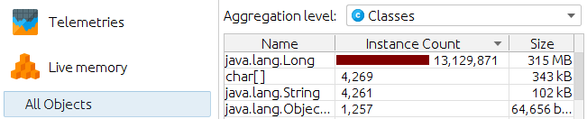

`Took 519 ms`

[GarbageCollectorFixExample.java](../src/main/java/presentation/gc/GarbageCollectorFixExample.java)

```java
public class GarbageCollectorFixExample {
  public static void main(String[] args) {
    new GarbageCollectorFixExample().count();
  }

  private void count() {
    long start = System.currentTimeMillis();
    long count = 0L;

    for (int i = 0; i < 100_000_000; i++) {
      count++;
    }

    long end = System.currentTimeMillis();
    System.out.printf("Value: %d\n", count);
    System.out.printf("Took %d ms", end-start);
  }
}

```

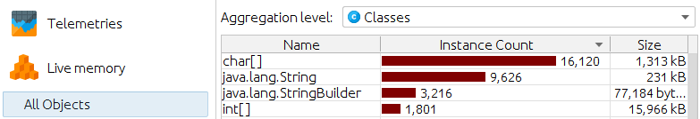

`Took 5 ms`

## Install JProfiler
[Download](https://www.ej-technologies.com/download/jprofiler/files)

IDE integration:
- Close IDE
- Select IDE configuration folder

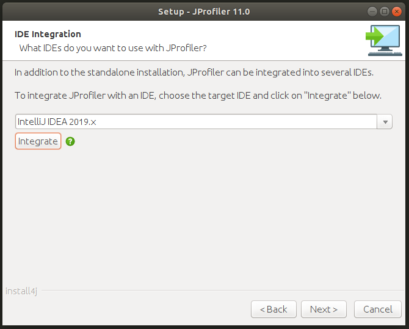

## Attach JProfiler

- `-agentpath` VM parameter
  - `-agentpath:/opt/jprofiler/bin/linux-x64/libjprofilerti.so=port=8849,nowait`

## Instrumentation vs Sampling

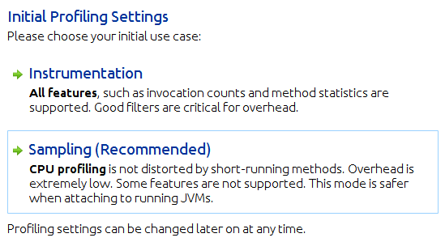


### Instrumentation
- All features.
- Filters must be used correctly. Otherwise overhead.

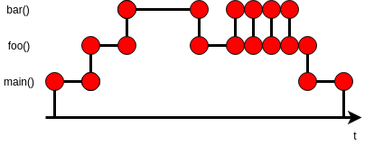

### Sampling
- When you do not know where bottlenecks are.
- Less overhead.

Sampling rate is N:
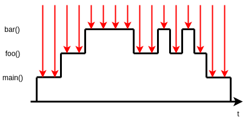

Sampling rate is 2N:
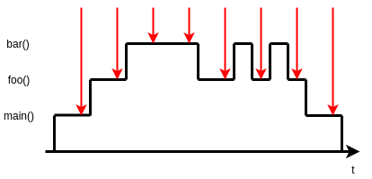

## Memory profiling

Memory leak: unused objects cannot be garbage collected.

### Healthy JVM

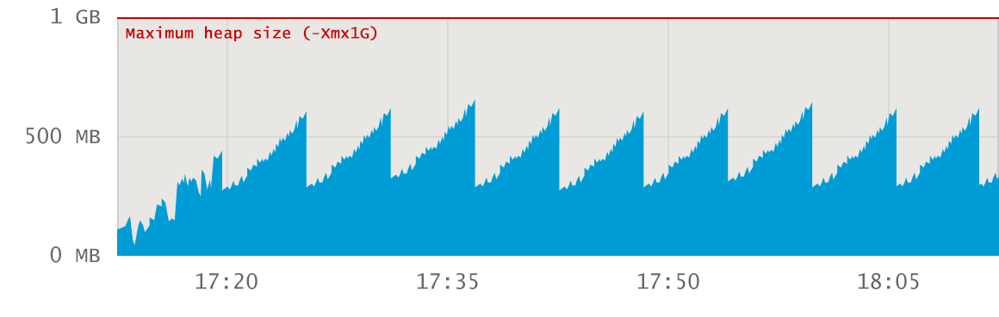

No memory leak. Flat baseline trend.

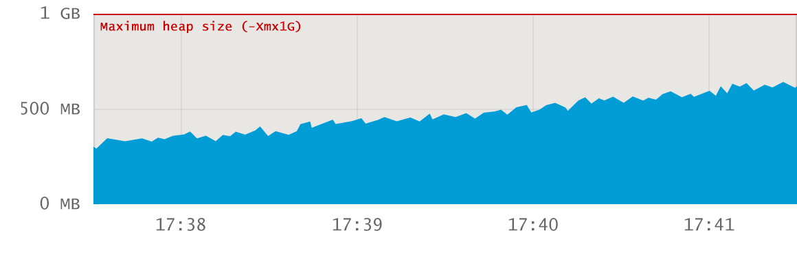

No memory leak. Period does not contain any major GC events, only minor GC events.

### Memory explosion at startup

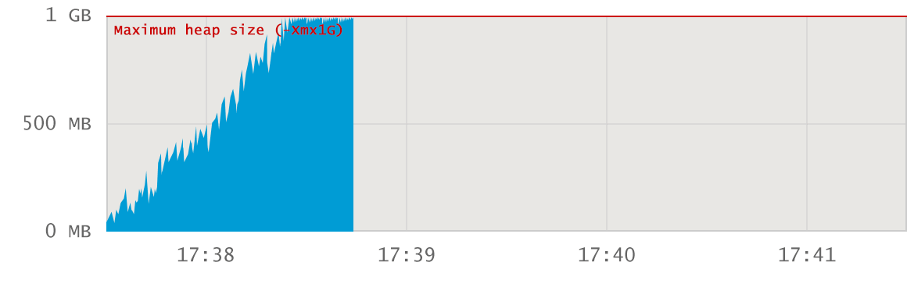

Probably not a memory leak. Big application has not given enough heap space.

### Surge allocation

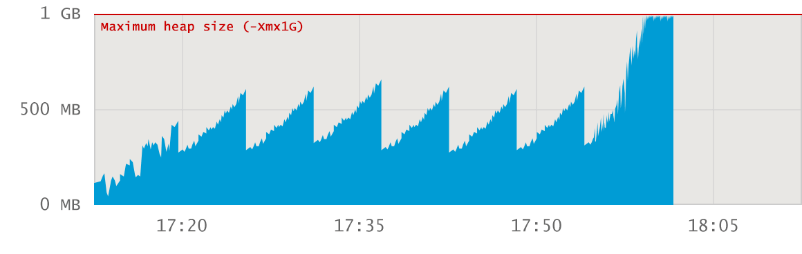

Probably not a memory leak. Too much data is loaded via specific action.

### Leaking Application

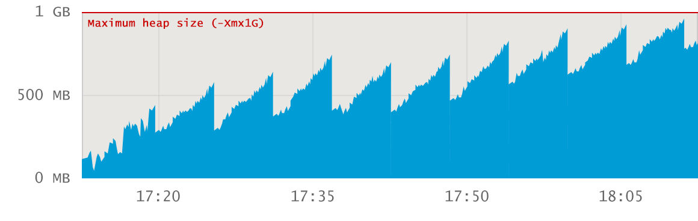

Memory leak. Baseline growth.

### Example

[Example](../src/main/java/presentation/memory/MemoryLeakExample.java)

- Call tree Recording: `Instrumentation`
- Initial recording profile: `Allocation call stacks`
- `Heap Walker`
- Pin `Mark Heap`
- `Take a Snapshot`
- `Use new` > `Classes` > `Ok`
  - To inspect only those objects that are created during the specific action we are interested in
- Double-click on "interesting" class name
  - `References` > `Incoming references`
- Select "interesting" object
  - `Show Paths To GC Root` > `Single root`
  - Now you see where leaked objects are stored
- Select `Merged incoming references`
- Allocations
  - Show code


## CPU profiling

Issues:
- Frequently invoked
- Inefficient code/algorithm

### Example

- Call tree Recording: `Instrumentation`
- Initial recording profile: `CPU recording`
- `CPU views`
  - `Hot Spots`
    - Thread status: All states
- Watch `Self Time`, `Average Time` and `Invocations`

[CpuUsageExample.java](../src/main/java/presentation/cpu/CpuUsageExample.java)

`Execution took 17903 ms`


[CpuUsageFixExample.java](../src/main/java/presentation/cpu/CpuUsageFixExample.java)

`Execution took 318 ms`

## Hands on!

- Prerequisites:
  - Java 8
  - Maven 3
  - JProfiler for monitoring

- Run application: `../src/main/java/lab/profiling/ProfilingApplication.java`
- Run load tests to create some traffic: `mvn gatling:test`

## Reference

Used materials.

- https://resources.ej-technologies.com/jprofiler/help/doc/index.html
- https://plumbr.io/
- https://github.com/CodingFabian
